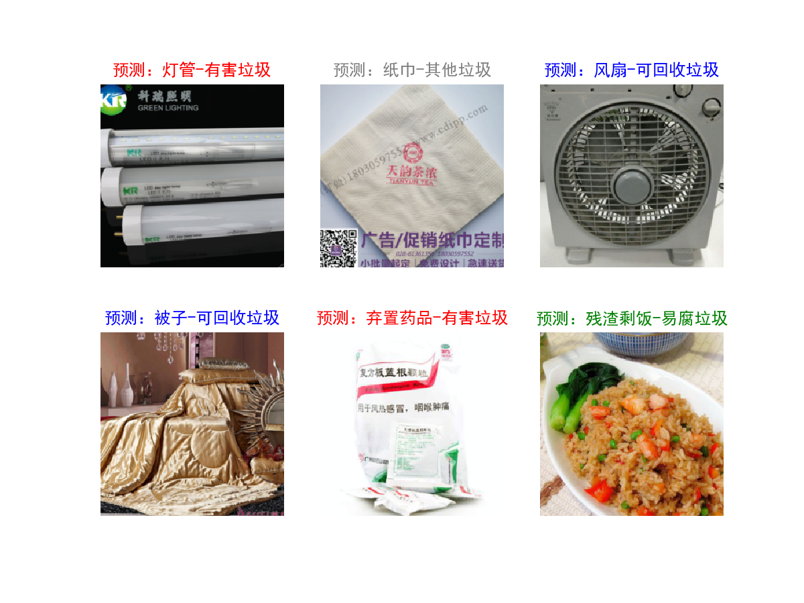
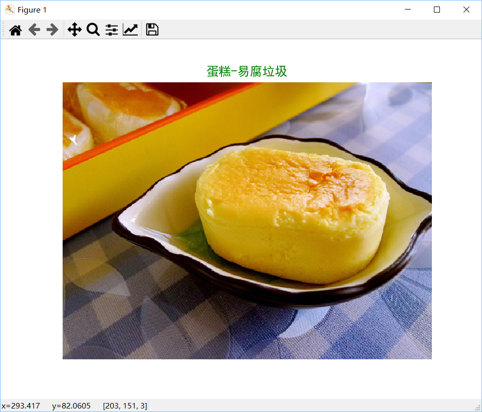

# 杭州生活垃圾分类程序


自2019年下半年开始，杭州市逐步开始推行新的生活垃圾分类方法。由于垃圾分类规则记忆起来较为困难，于是自己就想着开发一个生活垃圾分类程序帮助人们进行垃圾分类。

训练使用的数据集整理自[垃圾分类图片数据集](https://aistudio.baidu.com/aistudio/datasetdetail/27436)，分为训练集（1263张图片）和测试集（136张图片），目前只包含15种物体：
- 可回收垃圾：台历、风扇、金属、玻璃、塑料、被子
- 有害垃圾：电池、弃置药品、指甲油、灯管
- 易腐垃圾：香蕉皮、蛋糕、残渣剩饭
- 其他垃圾：纸巾、奶茶杯

后续会继续进行扩充。其中，垃圾分类方法参考自[杭州生活垃圾分类指南](https://zj.zjol.com.cn/red_boat.html?id=100699038)。

分类算法使用 PyTorch 搭建，考虑到后续打算做一个生活垃圾分类 APP，需要在手机上运行分类模型，因此分类网络使用了轻量级网络 MobileNet V2。模型使用了 PyTorch 官方的预训练模型权重，更改了最后一层的输出通道数，然后进行迁移学习。

目前只是完成了算法部分的开发，在训练集上迭代100次后，在自己构建的测试集上测试准确率达到76.64%，后续打算进一步扩充数据集，进一步训练提高准确率。

分类效果：

## 目录
- [安装](#安装)
- [使用](#使用)
  - [直接使用](#直接使用)
  - [导入使用](#导入使用)
  - [训练](#训练)
  - [可视化结果](#可视化结果)
- [License](#License)
## 安装
需要安装以下依赖库：
- PyTorch >= 1.4.0
- numpy >= 1.17.0
- torchvision >= 0.5.0
- matplotlib >= 3.1.2
- Pillow >= 7.0.0

训练使用的数据集：[下载](https://aistudio.baidu.com/aistudio/datasetdetail/31264)

训练后的模型：[下载](https://pan.baidu.com/s/1vdOtAzcPQ_DSyvTaFX-zqw )  提取码：50hb 
## 使用
### 直接使用
将 model.py 与 trash_classifier_model.pth 放置于同一目录下，然后命令行运行：
```shell
python model.py 图片路径
```
例如：
```shell
python model.py test.jpeg
```
则会输出分类结果并会可视化显示：

### 导入使用
将 model.py 与 trash_classifier_model.pth 放置于同一目录下，然后导入分类器：
```python
from model import TrashClassifier
```
初始化分类器并进行预测：
```python
clf = TrashClassifier()
ans = clf.predict(image)
```
image 是 PIL Image 对象，`predict()`方法返回一个包含物体名称和垃圾分类结果的元组。
### 训练
如果需要重新进行训练, 可以使用 train.py
```shell
python train.py
```
或用 Jupyter Notebook 打开 train.ipynb.

可以扩充数据集或使用新的数据集，数据集需分为训练集 train 和测试集 val ，每一个类别的物体图片放在对应文件夹下。

可以使用其他网络进行训练。修改完数据集后需要同步修改模型输出层参数。模型训练的超参数也可以进一步调整。
### 可视化结果
```shell
python visualize.py
```
可以可视化模型在验证集上的表现：

## License
[GPL](https://github.com/Bil369/HangzhouTrashClassifier/blob/master/LICENSE) &copy; [Bil369](https://github.com/Bil369)